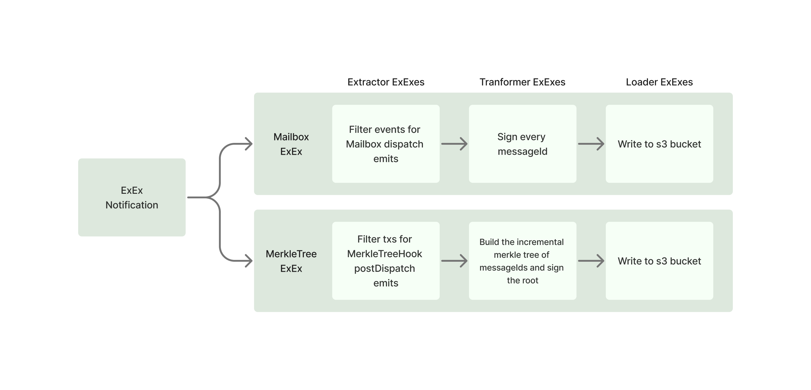

# Hyperlane ExEx

PoC of a Hyperlane [validator](https://docs.hyperlane.xyz/docs/protocol/agents/validators) built on top of Reth's new ExEx framework for post-execution hooks. See more details about ExEx [here](https://www.paradigm.xyz/2024/05/reth-exex).

### Introduction



A bit of background on Hyperlane's validators: validators are super lightweight off-chain agents that sign Hyperlane messages (either just the `messageId` as shown in the example, or by first building the incremental Merkle tree and then signing the root, which is currently live in production) from a source chain. These messages get verified on the destination chain by the respective [InterchainSecurityModule](https://docs.hyperlane.xyz/docs/reference/ISM/specify-your-ISM) contracts.

This can be easily transformed into an ETL pipeline as pictured:

- **Extract:** Observe Mailbox (or MerkleTreeHook) dispatch events from the node state.
- **Transform:** Sign the derived `messageId` with the EIP-191 standard scheme.
- **Load:** Post the signed payload to an openly available datastore (S3 bucket in our case).

Please note that only the simpler Mailbox ExEx has been built so far. This is just a simple example and not ready for production use.

### Setup

#### Prerequisites

- **AWS CLI:** For interacting with the S3 datastore.
  ```sh
  aws --version
  ```

#### Installation

1. **Clone the Repository:**

   ```sh
   git clone https://github.com/paradigmxyz/reth.git
   cd reth
   ```

2. **Install Dependencies:**

   ```sh
   cargo build
   ```

3. **Configure Environment Variables:**

   Create a `.env` file in the root directory and add the following:

   ```env
   AWS_ACCESS_KEY_ID=your_access_key_id
   AWS_SECRET_ACCESS_KEY=your_secret_access_key
   S3_BUCKET_NAME=your_s3_bucket_name
   ```

4. **Set Up AWS S3 Bucket:**

   - Create an S3 bucket to store the signed payloads.
   - Ensure the bucket has the appropriate permissions for read/write access.

#### Running the Validator

1. **Locally**

This is just for base network but can be easily adjusted for other networks.

   ```sh
   cargo run --bin hyperlane-reth
       node
        --full
        --chain base
        --datadir /tmp/data
        --rollup.sequencer-http https://mainnet-sequencer.base.org
        --rollup.disable-tx-pool-gossip
        --port 30305
        --discovery.port 30305
        --enable-discv5-discovery
        --discovery.v5.addr 0.0.0.0
        --discovery.v5.port 30306
        --discovery.v5.port.ipv6 30306
        --http
        --http.addr 0.0.0.0
        --http.port 8547
        --http.corsdomain "*"
        --http.api all
        --ws
        --ws.addr 0.0.0.0
        --ws.port 8548
        --ws.origins "*"
        --ws.api all
        --authrpc.jwtsecret /jwt/jwt.hex
        --authrpc.addr 0.0.0.0
        --authrpc.port 9551
   ```

2. **Docker setup**

### Tests

#### Running Tests

The project includes a suite of automated tests to ensure functionality and reliability.

1. **Execute All Tests:**
   ```sh
   cargo test
   ```


